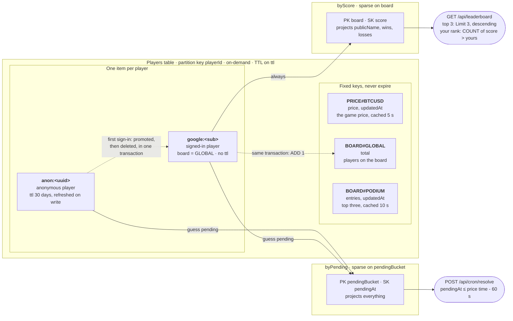

# Engineering spec - BTC up/down guessing game

**Author:** Inês Carvalho · **Date:** 27 Sep 2026

**Companion document:** `product-spec.md`, which covers what is being built and why.

---

## 1. The principle everything hangs off

**The server is the only source of truth about game state.** The browser sends two things: **who it is** (an identifier, so the score persists) and **what it guesses** (`up` or `down`). Nothing else it says counts. Which price was in effect, at what time, whether 60 seconds have passed, whether the price moved, and how many points exist are all decided server-side.

The distinction matters: the identifier is a claim about identity, not about the game. Even a forged one only lets someone play as another player - it cannot change prices, times or scores. Client-supplied prices and timestamps are ignored, and they do not exist in the API contracts in the first place.

That is the whole answer to the brief's one explicit requirement: guesses "resolved fairly".

---

## 2. Architecture

**One Next.js application, front and back.** The App Router serves the UI; route handlers under `app/api/*` are the backend. There is no separate API service, and client and server share one set of TypeScript types - a guess shape defined once is the shape the UI renders and the handler validates.

```
Browser (React 19, Astryx design system)
  |  GET /api/state, on the cadence in 3.1 (score, stats, price, pending guess, serverNow)
  |  POST /api/guess { direction }  (the direction, and nothing else)
  |  chart data: Coinbase directly (CORS confirmed open, section 5)
  v
Next.js (App Router, Node runtime)
  |-- app/               UI shell (server) + the game itself (client components)
  |-- app/api/*/route.ts state, guess, auth, leaderboard
  |-- lib/               resolveGuess, price adapter, DynamoDB access, name generator
        |-- DynamoDB: Players (PK playerId) + PRICE#BTCUSD cache item
        |-- Coinbase API (called only from here)
EventBridge Scheduler (1 min) -> Lambda -> POST /api/cron/resolve (shared-secret header)
                                           -> resolves guesses left by closed browsers
Hosting: AWS Amplify Hosting (Next SSR). Data and schedule: AWS CDK. Region: eu-central-1.
```

### 2.1 Why Next.js

Everything decided so far - no push from our server (3.1), a ticker that lives in the browser (5.1), a chart that is explicitly provisional - describes a **client-side game with a small stateful API**. On architecture alone the answer would be a static bundle on S3 and CloudFront with one Lambda behind it, and nothing in the game would be worse for it.

Next.js is chosen anyway, for two reasons that have nothing to do with rendering.

**The deliverable that can actually fail is the deployment.** The brief asks for a working public link. It is the one part that cannot be recovered afterwards, and it sits in the least familiar territory. Amplify Hosting runs Next natively: connect the repository, push, get a URL. The static-bundle alternative means S3, CloudFront, an origin access control, SPA rewrites for client-side routes and a cache invalidation on every deploy - each a small thing, each with an edge, all of them in the way of the link that has to exist.

**Auth.js takes the riskiest feature off the critical path.** Google sign-in is the one piece of section 6 that can absorb a whole day: the OAuth dance, token verification, session cookies. With the Next adapter it is configuration. Anywhere else it is `@auth/core` wired by hand, or verifying the ID token directly - doable, and section 9 already specifies those tests, but not where the budget should go.

Two lesser reasons, real but not decisive: one type system across UI and API, so the guess shape is defined once; and route handlers that test as plain functions, with no API Gateway event shapes to mock.

**The discipline that makes this defensible:** none of Next's server rendering is used for game data. Every piece of state arrives through `fetch` to a route handler, on the cadence in 3.1. Server components render the shell - layout, header, static copy - and stop there. Next is doing three jobs here, and none of them is rendering strategy: it serves a shell, hosts five route handlers, and runs Auth.js. That sentence belongs in the README, because it turns "this is overkill" from an accusation into a decision with its scope drawn.

**What it costs, said plainly**

- **An SSR runtime that is barely used**, deployed, warmed and watched for pages that are not personalised until the data arrives.
- **Cold starts** show up in the first interaction after a quiet period - and the cadence in 3.1 is deliberately sparse, so quiet periods are the norm here rather than the exception. Worth a README note rather than a workaround.
- **Two deployment artefacts, not one.** Amplify owns the web tier; CDK owns the data tier and the scheduler. They meet at one point: the Amplify SSR compute role needs an IAM policy for the table.
- **Vercel is deliberately not chosen**, simplest though it would be, because the brief's stack is AWS.

**What would flip this:** if Google sign-in leaves scope, the last reason for Next goes with it and the answer becomes a Vite SPA with one Lambda behind it. Worth remembering if time gets short - it is a reduction in scope, not a rewrite, because no game state depends on server rendering.

**Verify on day one, before writing real code**

- **StyleX compiling**, with a real Astryx component on screen and the atomic CSS emitted - starting from Astryx's own Next.js StyleX example rather than from a blank project. Next needs two plugins, `@stylexjs/babel-plugin` and `@stylexjs/postcss-plugin` with the `next/babel` preset, which is more setup than Vite's single unplugin, but it is documented and supported on the App Router with both Webpack and Turbopack. Half an hour here saves a Sunday.
- **The Amplify compute role reaching DynamoDB.** A connection point to resolve first, not to discover halfway.
- ~~Coinbase CORS from the browser~~ - **settled**: both hosts return `access-control-allow-origin: *` (section 5), so the chart fetches client-side and no proxy route is needed.

### Data model

```
Players
  PK playerId            "anon:<uuid>" or "google:<sub>"
     publicName          "AudaciousRaccoon", generated at creation
     board               "GLOBAL" when eligible for the leaderboard, else absent
     score               number      (may be negative)
     pendingGuess        { id, direction, priceAtGuess, createdAt } | absent
     pendingAt           createdAt of the pending guess, else absent
     pendingBucket       "PENDING" while a guess is pending, else absent (3.2)
     wins, losses        numbers, incremented at resolution
     currentStreak       signed number (+3 = three wins, -2 = two losses)
     previousStreak      currentStreak just before the latest result, so a
                         loss can read "streak ended at 2" (product spec 6.4)
     bestStreak          number
     history             last 10 resolved guesses
                         { id, direction, priceAtGuess, priceAtResolve,
                           createdAt, resolvedAt, delta }
     createdAt, updatedAt
     ttl                 anonymous players only: 30 days, refreshed on every
                         write (8). Signed-in players are counted on the
                         board, so they never expire
```

One item per player; gameplay access is always by `playerId`. Three more items share the table, each under a fixed key: the price cache (`PRICE#BTCUSD`, 5), the count of players on the board (`BOARD#GLOBAL`, 6.4) and the cached podium (`BOARD#PODIUM`, 6.4). None of them expires: their freshness is judged by `updatedAt`, since DynamoDB's TTL deletes lazily, hours late, and deleting the price would only lose the last-known value the game falls back on. Two sparse indexes hang off the table: one for the leaderboard (6.4) and one for the sweep (3.2).



Every arrow into an index is an attribute written or removed by the same conditional write that changes the game: starting a guess sets `pendingBucket` and `pendingAt`, settling it removes them, and the sign-in transaction is the only write that sets `board`. Neither index is ever scanned.

### API

Route handlers, all under `app/api`:

| Method | Route | Input | Output |
|---|---|---|---|
| POST | `/api/player` | - | sets the anonymous identity cookie (first visit) |
| GET/POST | `/api/auth/[...nextauth]` | - | Auth.js: Google sign-in, session, sign-out |
| GET | `/api/state` | session or anonymous cookie | `{ publicName, score, stats, price, priceUpdatedAt, priceStale, serverNow, pendingGuess, lastResult, history }`, or 401 with no player |
| POST | `/api/guess` | `{ direction }`, strictly: any other field is a 400 | `{ pendingGuess, serverNow }`; 409 if one already exists; 503 if the price is stale |
| GET | `/api/leaderboard` | - | top 3 rows, the caller's own row with its rank, and the eligible-player total |
| POST | `/api/cron/resolve` | shared-secret header | sweeps pending guesses; called by EventBridge Scheduler, not by browsers |

`GET /api/state` resolves the pending guess when the conditions are met, before responding. It is the normal resolution path and costs nothing extra.

`POST /api/guess` refuses a guess outright while the price is stale: locking in at an old number would be as unfair as resolving against one. The body schema is strict, so a request that carries a price or a timestamp is rejected rather than having the field silently ignored - the fairness rule shows up in the contract as well as in the handler.

Every handler runs on the Node runtime, not the edge: they use the AWS SDK and need the hosting role's credentials. Request bodies are validated at the boundary with Zod, and the inferred types are what the client imports - the contract cannot drift between the two halves, because there is only one definition of it.

---

## 3. Resolution

### The pure function

```ts
export function resolveGuess(
  guess: { direction: "up" | "down"; priceAtGuess: number; createdAt: number },
  priceNow: number,
  now: number,
): { resolved: false } | { resolved: true; delta: 1 | -1 } {
  if (now - guess.createdAt < 60_000) return { resolved: false };
  if (priceNow === guess.priceAtGuess) return { resolved: false };
  const wentUp = priceNow > guess.priceAtGuess;
  const correct = guess.direction === "up" ? wentUp : !wentUp;
  return { resolved: true, delta: correct ? 1 : -1 };
}
```

No network, no clock, no database. Trivial to test, and the first place a reviewer will look.

### The price at the deadline

**A guess settles against the market as it stood when its minute ran out, not against the price when someone asks.** Settling against "the latest price" would let the timing of a request choose the outcome: once the minute is up, a player who holds off asking could watch the market and ask at a moment that suits them, and the sweep only bounds that wait to a minute. So the price is fixed by the clock, not by whoever triggers:

- The **last trade at or before `createdAt + 60 s`** on Coinbase Exchange's BTC-USD book is the price at the deadline, and settles the guess if it differs from the locked price.
- If it equals the locked price, the guess stays in play (R4), and the **first later trade at a different price** settles it.

The trades are read after the deadline from Coinbase's public trade history (`/products/BTC-USD/trades`, newest first, paged back with `after`), the same book as the ticker, the chart and the live minute (section 5). `settleAgainstTape` in `src/lib/settlement.ts` is the rule over that tape, pure; `resolveGuess` is still the comparison it applies. Every trigger - the player's read, another tab, the sweep - reads the same history and so reaches the same outcome, however late it arrives, and a player can check the settling trade against Coinbase themselves.

The other end of the minute follows the same rule. The locked price is the ticker's last trade read fresh when the guess is placed, and `createdAt` is when that trade stood (section 5, "The locked price") - so the locked price is the last trade at or before `createdAt`, and the deadline is a minute after it on the same tape.

Normal play needs one page of trades: the browser asks at t+60 s, and a page covers a few minutes. A late sweep pages further back; past five pages, one-minute candles stand in (each minute read as its open and its close), which only happens when recovering from an outage. The deadline is on the server's clock and the trades on Coinbase's; both are NTP-synchronised, and the skew is far below the gaps between price changes that matter.

### Two triggers, one guard

- **Lazy, on `GET /state`:** the normal path while the player is watching. Free, since the request was happening anyway.
- **Scheduled sweep, every minute:** resolves guesses for players who closed the browser. It covers the brief's optional requirement and is what separates "works in the demo" from "works". How it finds them is 3.2.

Both take the same conditional write, so a guess resolves exactly once even when they collide. *When* the lazy path fires is a decision in its own right, set out in 3.1.

### A stale price resolves nothing

If the trade history cannot be read, no resolution happens and the guess stays pending; the next ask tries again. On screen this is the delayed-feed state: the cached ticker price older than the freshness threshold (15 s) is what the API reports as delayed, and the screen stops offering guesses; a guess is refused on its own terms whenever the fresh read it locks in at fails (section 5). Resolving against a guessed-at price would be unfair, and it is an obvious thing for a reviewer to probe.

### 3.1 How the browser learns the outcome

There is no WebSocket from our backend, and none is needed. The server never has to push, because the browser can work out when it is worth asking.

Both halves of the resolution condition are visible to the client. The minute is a local countdown. The price change is arriving anyway on the Coinbase ticker the chart already has open (5.1). So the browser asks at the moments that can plausibly produce an answer, rather than on a fixed interval:

| Moment | What the browser does |
|---|---|
| On mount, and when the tab becomes visible again | One `GET /api/state` - answers "is a guess in play, and has it settled?" |
| During the minute | Nothing. The countdown is local and there is nothing to learn |
| At t+60 s | One `GET /api/state` |
| Resolved | Stop asking about the guess; the idle refresh below takes over |
| No guess in play | One `GET /api/state` every 10 s, for the price on screen - the server's game price, which otherwise only moves when the client asks |
| Not resolved (price unchanged) | Wait for the ticker to print a price different from the locked one, then `GET /api/state` - at most every 2 s, since the server's price is cached for a few seconds and can lag the ticker |
| Socket down, or no ticks arriving | Fall back to polling every 5 s, backing off to 10 s after six polls (half a minute) have not settled it |
| A request fails | Whatever the moment above calls for, wait first: 5 s after one failure, doubling with each further failure in a row up to 60 s. Every interval here is counted from when the last request *started*, whatever came of it, so a failing server is not asked on every tick |

A normal guess therefore costs **two requests**: one when the app opens and one when the minute is up. Between guesses, a visible tab asks every 10 s so the price and its "updated" age stay current - six cheap reads a minute (the player item and the shared price item; Coinbase is still called at most once per 5 s cache window for everyone), and nothing at all once the tab is hidden. The chart refreshes on the same 10 s rhythm straight from Coinbase, and just after each minute turns, so the forming candle grows rather than jumping once a minute. Sustained polling exists only in the unchanged-price case, which on BTC is rare and is exactly the case the UI has a screen for.

Four properties worth stating, because they are what makes this safe rather than merely cheap:

- **The client triggers, the server decides - and the trigger's timing decides nothing.** The browser only says *look now*; the server reads the market at the guess's deadline and applies `resolveGuess`. Asking early costs one request that answers "not yet"; asking late gets the same answer asking on time would have. No trust is placed in the browser, and no outcome depends on its socket or its timing.
- **A failing server is not hammered.** The gaps above are measured from the last attempt, not the last answer, and consecutive failures back off exponentially to a minute. Without this, every open tab would ask an erroring endpoint once a second.
- **Hidden tabs do not poll.** Polling pauses on `document.visibilityState === "hidden"` and resumes with an immediate call rather than waiting out the interval. Without this, a forgotten tab hits the endpoint for hours.
- **The sweep is still required.** Client-side cadence serves the player who is watching; the scheduled sweep serves the one who closed the tab and comes back tomorrow. They are not alternatives.

This is the third trigger, then, and the only one that involves a decision: the lazy read and the sweep are mechanisms, this is a policy about when to fire the lazy one.

### 3.2 How the sweep finds work

The sweep needs the one access pattern the main table cannot serve: not "this player", but "every player with a guess outstanding". A scan would answer it and is ruled out for the same reason it is ruled out for the leaderboard (6.4) - it reads the whole table every minute, and gets slower as the game grows.

**A third sparse index, `byPending`:** partition key `pendingBucket`, a `board`-style constant (`"PENDING"`), sort key `pendingAt`. Both attributes are written in the same conditional write that creates a guess and removed in the one that resolves it, so an item is in this index for exactly as long as it has something outstanding - typically seconds.

The sparseness is the whole mechanism, and it is the same trick as the leaderboard's: the index holds the working set rather than the table. A sweep is one query for items with `pendingAt` at least 60 seconds ago, one read of the trade history back to the oldest of their deadlines, then the ordinary conditional resolution write for each - at most 100 per run, with the next run taking the rest. In the steady state it returns nothing and costs one read, and calls Coinbase not at all.

It also bounds the failure mode. If the scheduler stops, work accumulates visibly in a place that can be queried and counted, rather than sitting invisible across the table.

**How the schedule reaches the route.** EventBridge Scheduler cannot call an HTTPS endpoint, so it invokes a small Lambda that makes the one `POST` with the secret header, and decides nothing itself. The alternative, an EventBridge rule targeting an API destination, needs no code but is billed per call; Scheduler and Lambda both stay inside the free tier at one call a minute. The secret lives in SSM Parameter Store as a SecureString (section 8), read by the function at cold start, so it never appears in a template or in the function's configuration. No retries: a missed run is covered by the next one, and the sweep is idempotent regardless.

---

## 4. Concurrency and idempotency

- **Creating a guess:** `UpdateItem` with `ConditionExpression: attribute_not_exists(pendingGuess)`. A double click, a second tab or a network retry fails with `ConditionalCheckFailedException`, which the API returns as 409. This, not the disabled button, is what enforces rule R3.
- **Resolving:** `UpdateItem` conditioned on the pending guess still having the same `id`, in one write that moves `score`, `wins`/`losses`, `currentStreak`, `bestStreak` and prepends to `history`. The loser of a race changes nothing.
- **Counters are never recomputed from history.** They move in the same write as the score, so they cannot drift when the history list is trimmed to its last 10 entries. A full audit trail would be its own table keyed by `playerId` and resolution time - a README note, not work for today.

---

## 5. Price data

| Use | Source | Why |
|---|---|---|
| **Locked price** (placing a guess) | Server, read fresh from the ticker for that request | Fairness; a cached price could be one the player has already seen the market leave |
| **Game price** (on screen) | Server, shared cache | From the client it would be forgeable; the cache keeps it to one Coinbase call per window |
| **Settlement price** (resolution) | Server, trade history at the deadline (3) | Fixed by the clock, so the timing of a request cannot choose it |
| **Chart** (history and ticker) | Comes from the client | Cosmetic; saves server invocations and cuts latency |

Public Coinbase Exchange endpoints, unauthenticated, needing neither an account nor a key:

- Ticker (the game price, server-side): `https://api.exchange.coinbase.com/products/BTC-USD/ticker`
- Trades (the settlement price, server-side): `https://api.exchange.coinbase.com/products/BTC-USD/trades`
- One-minute candles: `https://api.exchange.coinbase.com/products/BTC-USD/candles?granularity=60`
- Live ticker: WebSocket `wss://ws-feed.exchange.coinbase.com`, `ticker` channel

**CORS is open, checked on day one.** Both hosts answer a cross-origin `GET` with `access-control-allow-origin: *`, confirmed at the header level with `curl` and then in the browser from the deployed origin - the only test that counts, since `curl` ignores CORS entirely and would have succeeded either way. The endpoints are public and unauthenticated, so the wildcard costs nothing: no credentials are sent with these requests.

So the chart fetches Coinbase directly and there is no proxy route. **The fallback stays in the README rather than in the code**: if the policy ever changes, the chart moves behind a cached `GET /api/history` using the same cache-item pattern as the price. Worth one paragraph there, because a third party's CORS policy is not ours to rely on forever - and because the change would put candles through our Lambda, where a cold start stops being invisible.

None of this touches the game price, which is read server-side whether or not the browser could read it too.

**One market for everything.** The game price is the Exchange ticker's last trade, the same book the chart's candles and the live minute's WebSocket read. It was first specified as Coinbase's retail spot price (`api.coinbase.com/v2/prices/BTC-USD/spot`), which runs $20-30 away from the Exchange price: the live minute then opened "ahead by $29" before the market had moved at all. Settling on the same market the player watches keeps the provisional line honest; the game is exactly as fair either way, since one source decides every outcome.

**Caching:** the latest price lives in its own DynamoDB item with a timestamp and a few seconds of TTL, so one Coinbase call per window serves every player's screen. Per-request calls would hit rate limits with two players and an open tab.

**The locked price is never the cached one.** The cached price can be up to 5 s old, and up to 15 s while Coinbase is failing, and it is the number on the player's screen. Locking a guess at it would let a player who can see the market has already moved (on the chart, which reads Coinbase directly) guess with that knowledge: better than a coin flip. So `placeGuess` reads the ticker for that request (`fetchFreshPrice`), and if the read fails the guess is refused (`price-unavailable`), with no fallback to the cache. The fresh price is still written to the cache, so everyone's screen gets it. Before reading, one read of the player item turns away a player who cannot guess (none, or a guess already pending) without calling Coinbase, so the extra calls are bounded by about one per player per minute; the conditional write still decides R3.

`createdAt` is when the locked price stood, not when the read came back. The ticker's last trade is the price from its trade time until the response, so it held at the trade time if that falls inside the request, and at the start of the request if the trade came before it (a quiet market); a trade time after the response (clock skew) is held to the response (`observedAt`). The locked price is therefore the last trade at or before `createdAt`, the same rule settlement applies at `createdAt + 60 s` (section 3). Reading the lock from the trade history instead would give the same price with a second endpoint and paging; the ticker already names its trade and its time, so it is the simpler of two equivalent reads.

**Failure:** retry with exponential backoff, then serve the last known price with its timestamp (for the screen; a guess is refused instead, above). The game degrades, it does not break. On screen: the last price stays up, marked delayed; once it is past the 15 s guard the guess buttons go quiet and the strip says why, so a guess is refused before it is tried (`priceBlocksGuess`); a game that has never had a price says so rather than showing a loading placeholder forever. The chart fails on its own, with its own note, and recovers on its next refresh.

### 5.1 The live minute: a browser-side ticker

While a guess is in play the chart can switch from the hour of candles to the minute itself, drawn live (product spec, 6.1). That view is fed by a **WebSocket straight from the browser** to Coinbase's public feed - `wss://ws-feed.exchange.coinbase.com`, `ticker` channel, `BTC-USD`, no key and no auth. It never touches our backend.

- **Sampled at one point per second.** BTC ticks several times a second; the socket's messages land in a buffer and a one-second timer takes the latest, giving sixty points across the minute. Cheaper, and a jagged one-second line reads better here than a smooth one.
- **Drawing:** append to the path's `d` rather than re-rendering the series, or draw to a canvas. With sixty points either is trivial, and the append keeps the SVG approach consistent with the candle view.
- **It cannot affect the outcome, by construction.** The socket's prices are never sent anywhere: resolution reads the trade history at the deadline, server-side. The UI labels the live delta *provisional*, because the settled price can differ by a few cents.
- **Connection handling:** reconnect with exponential backoff and jitter; while disconnected, fall back to the price arriving in the `GET /api/state` polls described in 3.1, grey the line and show a reconnecting note. The socket is opened when a guess starts and closed when it resolves - no socket sitting open on an idle screen.
- **`prefers-reduced-motion`:** no drawing animation and no transitions; the line and the number update in place.
- **Testing:** the sampling and path-building are pure functions over a list of `{t, price}` - a fake feed drives them, and no test needs a socket.

---

## 6. Identity, names and the leaderboard

### 6.1 Anonymous players

On first contact the server issues an opaque `anon:<uuid>` and sets it as an `httpOnly` cookie - JavaScript cannot read it and the browser sends it automatically. `localStorage` would also work, but the cookie keeps section 1 literally true: the client never handles the identifier, so there is nothing for it to tamper with and nothing for the API contract to carry.

Limitations, to be stated in the README: clearing browser data creates a new player; another browser or device is another player; and anyone who learns an id can play as that player. There is also no defence against minting a thousand fresh ids - without authentication there cannot be one.

### 6.2 Google sign-in

| | Anonymous | Signed in |
|---|---|---|
| `playerId` | `anon:<uuid>` issued by the server | `google:<sub>`, Google's stable user id |
| Lives in | An `httpOnly` cookie | A session cookie issued by our backend |
| Survives | That browser only | Any device the player signs in on |

`sub` is the only identifier worth keying on: email addresses change hands, `sub` does not.

This section sets out **what has to be true** for sign-in to be safe. Section 6.5 covers who does it, and the answer there is a library rather than our own code - but the properties below are the ones to check, whoever implements them.

**Google's assertion has to be verified, and that is the entire security boundary.** Whatever the flow, what arrives from Google is an ID token, and an unverified ID token is JSON anyone can forge. It has to be checked against Google's published keys (JWKS, cached): signature, `iss` (`accounts.google.com` or `https://accounts.google.com`), `aud` - our client id, which is what stops a token minted for some other application being replayed at ours - and `exp`. The flow must also bind the response to the request that started it, so a token cannot be replayed from elsewhere; how that binding is spelled - `nonce`, or `state` with PKCE - depends on the flow.

**Our session is ours, not Google's.** Google's token is verified once and then discarded; from that moment the player carries a cookie our backend issued - `httpOnly`, `Secure`, `SameSite=Lax` - which is the only credential the game reads. Every later request carries it exactly as the anonymous flow carries its id, and the rest of the game cannot tell the two apart. The secret that protects it is never committed, and sliding expiry keeps a returning player signed in.

**Nothing else about the Google account enters the game.** Identity reduces to `google:<sub>` at the boundary; the display name and avatar are stored only if the signed-in UI shows them back to the player, and never leave in a leaderboard response.

**Merge on first sign-in.**

- Google player does not exist yet: the anonymous record is promoted - score, counters, history and any pending guess move across, and the anonymous item is deleted.
- Google player already exists: the signed-in record wins, and the UI says so rather than silently discarding the local one. Summing the two would let anyone farm points in incognito windows and merge them in.

The merge is one transactional write conditioned on the source still existing, so a double click cannot merge twice.

**Data protection.** Store `sub`, plus display name and avatar only if the UI shows them. Email is not needed, so the scope is `openid` alone (plus `profile` when the name is shown). Deletion is one `DeleteItem`.

### 6.3 Generated names

Generated server-side when the player item is created, from two curated word lists (adjectives and animals) joined in PascalCase - `AudaciousRaccoon`. Curated, so no combination is unfortunate; with roughly 200 × 200 entries there is plenty of room, and collisions are allowed rather than retried, since `playerId` is the real key and a duplicate name costs nothing. Generation is pure and therefore trivially testable; the name is stored, never recomputed, so it is stable for the player's lifetime.

The Google display name, when there is one, is stored only if the signed-in UI shows it to the player themselves. It never goes into a leaderboard response.

**Country was considered and dropped.** A flag beside each name would have come from the `CloudFront-Viewer-Country` header, which requires controlling the distribution's origin request policy - and with Amplify Hosting the distribution is managed, so that control is not ours to exercise. The alternative, a geo lookup per request, is a dependency and a privacy question for decoration. The board is global only, which also keeps it to one index instead of two.

### 6.4 Leaderboard queries

Ranking needs the opposite access pattern from the rest of the game: not "this player", but "the best players in order". A scan is out - it reads the whole table on every request and gets slower as the game grows.

**One sparse global secondary index:**

| Index | Partition key | Sort key | Query |
|---|---|---|---|
| `byScore` | `board` = `"GLOBAL"` | `score` | the top of the board |

Sparse is doing real work here: `board` is written only for players eligible for the board, which means signed-in players. Anonymous players never carry the attribute and therefore never enter the index - the eligibility rule is enforced by the data model rather than by a filter someone can forget. Promoting an anonymous player at sign-in is what writes them in.

**Projection matters as much as the key.** A board row shows name, score, success rate and number of guesses, so the index projects `publicName`, `score`, `wins` and `losses` - everything a row needs. Without that, each of the three podium rows costs a second read back to the table, which would undo the point of querying an index at all.

Numeric sort keys order negatives correctly, so a player on -6 sorts below one on 0 without any offset trickery.

**Three queries**, which is what the four-row design costs:

1. **The podium:** `Query` on the index, `ScanIndexForward: false`, `Limit: 3`. Cheap and constant.
2. **The player's rank:** `Query` on the same index with `score > :myScore` and `Select: COUNT`. Rank is that count plus one, so players on equal scores share a rank for free - exactly the behaviour the product spec asks for, with no tie-breaking rule to invent.
3. **The total:** a counter item incremented with an atomic `ADD` when a player becomes eligible for the board, so "138th of 1,204" does not require counting anything.

If the player is already in the podium rows, queries 2 and 3 are skipped.

**Known trade-offs, worth naming before they are found:**

- **The rank query is O(players above you).** A `COUNT` query still reads the matching items server-side, so a player near the bottom of a large board is the expensive case - the opposite of the usual intuition. At a few thousand players this is a handful of reads and stays in the free tier. The scale answer is a histogram of score buckets maintained at resolution time, where rank is the sum of the buckets above plus an approximation inside the bucket; that is a README line, not today's work.
- **The rank is read live, not cached.** The board has its own endpoint, `GET /api/leaderboard`, fetched on load and after each result rather than on the `GET /api/state` cadence, so there is no burst around a resolution for a cache to absorb. The podium is cached (below); the caller's row is theirs alone.
- **One hot partition.** Every row shares the partition key `GLOBAL`, so writes concentrate. Fine at this volume; at scale the key becomes `GLOBAL#<shard>` with a scatter-gather read.
- **Eventual consistency.** GSIs lag their table by a moment, so a player can see their new score on their own card before it moves on the board. Acceptable for a leaderboard, and worth one sentence in the README rather than a fix.
- **Caching.** The podium is identical for everyone, so it is cached for ten seconds in the same cache-item pattern used for the price. Not at CloudFront: the distribution in front of Amplify Hosting is managed, so cache behaviour there is not ours to configure - the same constraint that dropped the country (6.3). The player's own row is not cached, since it is theirs alone.

### 6.5 Sign-in implementation: Auth.js

With Next.js chosen, sign-in is **Auth.js** (formerly NextAuth) with the Google provider, mounted at `/api/auth/[...nextauth]`. It runs the OAuth redirect flow, verifies the ID token against Google's JWKS, binds the response to the request with `state` and PKCE, and issues its own encrypted session cookie. Every property 6.2 asks for is one the library provides - correctly, and without sixty lines of ours to review.

What still has to be written, because no library knows about this game:

- **The `jwt` and `session` callbacks** map Google's `sub` onto our `playerId` (`google:<sub>`) and put it in the session, so every handler reads identity the same way regardless of how the player arrived.
- **The `signIn` callback runs the anonymous merge** described above, reading the anonymous cookie and promoting that record once, under the same conditional write.
- **Cookie settings** stay explicit: `httpOnly`, `Secure`, `SameSite=Lax`, with `AUTH_SECRET` never committed: it is an Amplify app environment variable that `amplify.yml` copies into the runtime, alongside `AUTH_URL`, the public origin Auth.js builds its callback from (behind Amplify's proxy the app sees itself as `localhost:3000`).

As built (`src/auth.ts`, `signIn` in `src/lib/game.ts`):

- **Scope `openid` only.** The UI never shows the Google name, so it is not asked for; the JWT carries `playerId` and nothing else from Google. Checks are `pkce` and `state`, JWT sessions (no adapter), sliding 30 days.
- **The merge is one `TransactWriteItems`:** put `google:<sub>` with `board` set (condition: does not exist), delete the anonymous item (condition: `updatedAt` and the pending guess unchanged since read - the only writes to an anonymous item start or settle a guess, and both change them), and `ADD 1` to the board counter. A conflict re-reads and retries, so a guess settling mid-merge is carried over rather than lost, and a double click merges once. This is the only place a player joins the board.
- **Outcomes:** `promoted`, `kept-existing` (the account wins; the anonymous item is left alone, and comes back on sign-out), `returning` (account exists, browser had not played) and `created`. The callback leaves the outcome in a short-lived `httpOnly` cookie; the next `GET /api/state` reports it once as `signIn` and clears it, and the screen says what happened (product §7).
- **Identity is read in one place** (`playerIdFrom`): the session's `google:<sub>` first, the anonymous cookie otherwise. Without `AUTH_SECRET`, sign-in is off and the game runs anonymously.
- **Sign-in and sign-out are server actions** behind plain forms, so they carry Auth.js's CSRF protection and work before hydration.

Two alternatives, named in the README rather than built: **Cognito with Google federated**, the more AWS-native answer that also gives anonymous-to-account promotion out of the box; and **Google Identity Services**, where the browser obtains an ID token and posts it once to an endpoint of ours that verifies it by hand against the JWKS - which is what 6.2 describes when there is no framework to lean on, and the shape this would take in the Vite variant of 2.1. Using a library here is a deliberate choice: the risk in authentication is in the details it already handles, and the time saved goes into the parts of the game that are actually ours.

---

## 7. Frontend technical notes

### 7.1 UI layer: Astryx

The interface is built with [Astryx](https://astryx.atmeta.com/), Meta's open-source design system: over 170 accessible React components, dark mode, themeable tokens, built on React 19 and StyleX, with a CLI and MCP support. Components come from `@astryxdesign/core`.

Why it fits this build:

- **Accessibility and dark mode arrive with the components**, so the half-day goes into the game's own logic rather than into re-implementing a button, a dialog and a focus trap. The things the components cannot know - the `aria-live` announcement of a result, the reduced-motion rule for the confetti, where focus goes when the control holding it disappears - stay ours. The guess buttons are unavailable through `aria-disabled` rather than `disabled`, so a pressed button keeps focus and its hint ("your guess is in play") stays reachable by Tab; when a re-render removes the focused control (the view toggle or slider at a result, a dismissed banner, "Try again"), focus moves to the guess strip, which at the end of a round holds the result.
- **It is a token-based design system**, which is the same shape of problem as the one epilot is working through internally. Using one deliberately, and being able to say where its opinions end and mine begin, is worth more here than hand-rolled CSS.
- **It is built to be read by agents**, with a CLI and an MCP server over its own documentation - which is a genuinely new idea in this space and one I want to use on something real rather than read about. A take-home is a good place to find out whether it changes how the work feels.
- **Examples for both Next.js and Vite**, which is what makes it safe to commit to here: the build integration is a clone away rather than a discovery.

What it pulls in, and must be set up first:

- **React 19+** and **StyleX**, which is compile-time CSS-in-JS - the Next build needs `@stylexjs/babel-plugin` and `@stylexjs/postcss-plugin` wired in before any UI work, not after. Astryx components render in server components; anything interactive (the buttons, the countdown, the chart) is marked `"use client"`.
- **A pinned version**, with the upgrade story as a README line rather than a surprise.
- **The official examples as the starting point.** Astryx ships example applications for both Next.js - including one for the StyleX integration specifically - and Vite. Cloning the Next example and diffing against it is a faster and more reliable day one than wiring the build from the documentation, and it is also the cheapest way to test the Vite fallback in 2.1 if it is ever needed.
- **A Dracula theme.** Astryx themes are token-based, so the palette is a token set rather than overrides: near-black ground (`#17171F`), `#21222C` surfaces as in the rendered screens, and the Dracula accents. It lives in `src/themes/dracula.theme.ts`, extends Neutral, and is compiled with `astryx theme build` so it is present on first paint rather than injected at hydration. What the theme has no slot for - the two hero gradients and the ink on them - is a small StyleX token file of the app's own (`src/components/ui/tokens.stylex.ts`). The two hero buttons carry pastel gradients (mint to cyan for higher, pink to lilac for lower), which is the one place gradient is used. Outcomes never rely on hue alone - each direction has an arrow and a word, and the loss banner uses a pastel coral rather than full `#FF5555`.

**The charts are hand-built SVG, not a charting library.** Sixty candles are four `path` elements - up bodies, down bodies, up wicks, down wicks - and the live minute is one path plus a filled area. A charting library would bring a bundle, a theming layer to fight and defaults to undo, for a picture with one simple tooltip, no zoom and no axes worth configuring. It also means the dashed locked-in line, the shaded minute and the provisional label are ordinary elements rather than plugin points.

**Each tick can be read, by pointer or keyboard.** Hovering either chart shows the nearest tick - a minute's open, high, low and close, or a second's price and how the guess stood - with a crosshair. The same reading is reachable without a mouse: a transparent slider (`role="slider"`, the WAI-ARIA pattern) lies over the plot, so Tab reaches it, the arrows step one tick, Page Up and Down ten, Home and End jump to the ends and Escape puts it away. Its `aria-valuetext` is the tick as a sentence, which a screen reader reads as it moves; the picture keeps its one-sentence summary. Which tick a pointer or key lands on is a pure function (`src/lib/chart-inspect.ts`).

**Both charts have a price axis.** Gridlines sit at round prices chosen by a pure function (`src/lib/axis.ts`: steps of 1, 2, 2.5 or 5 times a power of ten, whichever gives the count closest to four), labelled in a fixed 80px gutter on the right - the same on both charts, so the plot does not shift when the view switches, and the time axis below stops where the gutter begins. Labels show whole dollars when the step is whole and cents when it is not ($2.50 steps would otherwise put a rounded price on a line that is not at it). They are hidden from assistive technology: the summary and the inspector already give every price as a sentence, and the axis would only repeat them.

**A charting library was reconsidered for accessibility, and declined again.** The question was whether a library would guarantee accessibility out of the box, and bring an axis with it. None guarantees it. Highcharts has the most complete accessibility module - keyboard navigation between points, screen-reader descriptions, a data-table view - but candlesticks need Highcharts Stock, a paid licence beyond personal use, and about 300 KB to re-theme. ECharts can generate a text description, with thin keyboard support. TradingView's Lightweight Charts draws the best candles, but on a canvas, which a screen reader cannot read at all without rebuilding what is described above beside it. Recharts, Victory and visx leave candles, accessibility or both to the caller. What these charts already have - a one-sentence summary each, every tick reachable by keyboard and read as a sentence, axe clean in every state, rendered contrast included (section 9) - is what those libraries offer at best, and it is tested here; a library would replace it with something to test again rather than a guarantee. It would also cost what hand-built SVG was chosen for: pure, tested geometry, the locked-in line, the shaded minute and the provisional tag as ordinary elements, and a small bundle. The one real gap was the axis, and it was cheaper to add than to change libraries.

### 7.2 Behaviour

- **Event-driven requests for game state** rather than a socket to our own backend, on the cadence set out in 3.1: the browser asks when the countdown ends and when the ticker shows the price has moved, not on a fixed interval. A persistent connection to our server would exist to deliver one message per minute that the client can already predict. The one socket in the app goes straight to Coinbase for the live minute (5.1), where a second of latency would be visible.
- **The chart view is local state**, defaulting to the hour and switching to the minute when a guess starts; the player can switch back, and the choice is remembered for the session only.
- **Countdown from server time.** Every response carries `serverNow`; the client derives the offset once and counts from there, so a skewed clock cannot show a wrong countdown.
- **Page Visibility API:** pause the fallback polling on a hidden tab and resync immediately on focus, rather than waiting out the interval. Saves calls and avoids a frozen countdown.
- **Multiple tabs reconcile** on every `GET /state`; the server is the truth and a pending guess disables the buttons everywhere.
- **Explicit loading and error states:** first load, offline, 409 on a duplicate guess, delayed feed.
- **Price formatting** with `Intl.NumberFormat` and fixed decimals, so the number does not jump; the delta against the guess price is derived, not stored.
- **Accessibility:** results announced through one `aria-live="polite"` region, confetti `aria-hidden` and skipped under `prefers-reduced-motion`, no meaning carried by colour alone, and every chart tick readable from the keyboard (7.1).

---

## 8. Operations

- **Deployment:** AWS Amplify Hosting builds and runs the Next app, wired to the repository so a push to `main` deploys - but only once every test has passed in the same build: the unit and infra tests, then the accessibility tests (section 9) against the build about to ship, on DynamoDB Local in its own table. A red test fails the build and the last good deployment stays live. The table, its two indexes, the scheduler and the IAM role live in a small CDK stack, and Amplify consumes their names as environment variables. OpenNext with CDK is the alternative if more control is needed - and is what the country flag and CloudFront-level caching would have required (6.3, 6.4) - named in the README as such.
- **Runtime identity:** the app runs under an execution role with least-privilege access to the one table and its indexes. No AWS keys reach the client, and none exist in the repository.
- **Secrets:** `AUTH_SECRET` and the Google client id and secret are Amplify app environment variables, copied into the runtime by `amplify.yml`. The cron shared secret is also in SSM Parameter Store as a SecureString, where the sweep Lambda reads it. None is ever committed.
- **Security:** same-origin by construction, since the API is part of the app - no CORS configuration to get wrong. The cron route rejects anything without the shared secret.
- **Abuse, and what actually bounds it:** the conditional write on `POST /api/guess` already limits a player to one guess until it resolves, which is at most one per minute - a tighter bound than any rate limiter would have set, enforced by the data rather than by a counter. A counter would also need shared state to mean anything, since each runtime instance has its own memory. What that leaves exposed is minting fresh anonymous players and read volume on `GET /api/state`; the first is the limitation already stated in 6.1, and the second is what the cadence in 3.1 keeps small. Named rather than solved.
- **Observability:** structured JSON logs with a request id and `playerId`, metrics for price-fetch failures and resolved guesses, one CloudWatch alarm on the failure metric.
- **Retention:** TTL on inactive anonymous player items, 30 days, refreshed on every write. Signed-in players carry no TTL: they are on the board and counted in its total, and an expiry would delete them while the counter still counted them.
- **Cost:** DynamoDB on-demand and Amplify's build and hosting stay inside the free tier at this volume; the SSR runtime is the one line item a static bundle would not have had.

---

## 9. Test plan

- **Resolution:** price up with an `up` guess; price down with an `up` guess; unchanged price; under 60 s; exactly 60 s.
- **Route handlers with a mocked SDK**, called as plain functions: a double guess returns 409; resolution is idempotent; a new player starts at 0; counters and streaks move in step with the score, including the sign flip when a winning streak breaks.
- **Coinbase adapter:** contract test against a recorded response, plus the failure paths (timeout, 429).
- **Google sign-in:** wrong `aud`, wrong issuer, expired token and tampered signature are all rejected; a valid token issues a session; the merge runs once and is refused the second time.
- **Names and leaderboard:** generation is pure and draws only on the curated lists; an anonymous player never carries the `board` attribute and signing in adds it; the board orders negative scores correctly; equal scores produce equal ranks and the next rank skips accordingly; a podium player gets no duplicate row; no response ever contains a Google display name.
- **The sweep (3.2):** a pending guess enters the index on creation and leaves it on resolution; a sweep with nothing outstanding returns nothing; a guess left by a closed browser is picked up once, and a sweep racing a `GET /api/state` still resolves it exactly once.
- **Frontend:** buttons disabled (`aria-disabled`, keeping focus) while a guess is pending; focus never falls to the page when its control goes away; the "waiting for price change" notice; the countdown uses server time; no confetti under `prefers-reduced-motion`.
- **Request cadence (3.1):** the scheduler is a pure function over `{ countdownEnded, lockedPrice, lastTickerPrice, socketAlive, visible, msSinceLastAsk, consecutiveFailures, fallbackPolls }` returning *ask* or *wait*, so a fake feed and a fake clock cover it: one call at t+60; no calls during the minute; a call when the ticker first differs from the locked price; fallback polling only when the socket is down, backing off from 5 s to 10 s; a failing server backed off exponentially to a minute, never asked on every tick; nothing at all while hidden.
- **Accessibility:** axe-core runs in a real browser over the screen's states - first visit at desktop and phone width, the chart inspector reached by keyboard, a guess on the live minute, a win and a loss - against WCAG 2.2 A and AA, colour contrast as rendered included (`npm run test:a11y`, Playwright against a production build and DynamoDB Local, in its own table). The outage is tested too: a second copy of the app with the server's Coinbase fetch switched off (`E2E_PRICE_FEED_DOWN`, test-only) and the browser's Coinbase requests blocked, checked with no price ever cached and with a stale one - each must say what is happening, pause guessing, and pass axe. axe's best-practice rules run as well (one `h1`, content in landmarks). What no scanner can see is tested directly: the banner landmark holds the `h1` and sits outside `main`, every panel is a region with an `h2`, the countdown is a `timer`, the guess buttons read as one phrase, and a guess that does not go through is announced through the one live region - twice in a row, heard twice. axe cannot judge text on a gradient, so it reports the hero buttons as needing review rather than failing; that one case is not covered automatically.
- **Optional:** one end-to-end run with Playwright and a fake clock.

---

## 10. Definition of done

- [ ] No client-supplied price or timestamp can affect an outcome, verifiable in the network tab.
- [ ] Guess creation and resolution are each idempotent under concurrent calls.
- [ ] A guess left behind by a closed browser resolves within a minute of becoming resolvable.
- [ ] A stale price feed blocks resolution and is reported as such.
- [ ] Sign-in rejects malformed, expired and wrongly-audienced tokens; the anonymous merge is single-shot.
- [ ] The leaderboard and the sweep are both served from indexes rather than scans, and no response carries a real name or an IP address.
- [ ] Tests pass in CI; README covers the design, how to run it and how to deploy it.
- [ ] Public deployment reachable by link, from a public repository.

---

## 11. Risks

| Risk | Mitigation |
|---|---|
| ~~Coinbase CORS blocks browser calls~~ | Checked on day one: open on both hosts. The proxy-route fallback is documented in the README in case the policy changes |
| AWS and CDK are the unfamiliar part | Deploy an infrastructure "hello world" first, before any game code |
| Next.js on AWS is more deployment than a static bundle | Amplify Hosting first, because it runs Next natively; the fallback is OpenNext with CDK, decided on day one rather than the evening before delivery |
| The scheduled sweep depends on an HTTP route being reachable | The shared secret is the only guard, so the route is written and tested before the scheduler exists; if it proves awkward, the sweep moves to a standalone Lambda in the same CDK stack |
| Google OAuth setup drags | Consent screen and client id done before any code; anonymous play alone satisfies the brief, so sign-in can be dropped - but the leaderboard goes with it, since eligibility is being signed in, and 2.1's flip condition on the framework applies too |
| Settlement reads Coinbase's trade history per resolution, from shared Amplify IPs, against a public rate limit | Normal play is one request per guess; only the unchanged-price case repeats, at most every 2 s. If limits bite, the tape is cached per deadline second in the price item's pattern |
| Scope creep (bot, extra providers, time-windowed boards) | They stay in the README's future-work list |
| Astryx and StyleX change the build | Start from the official Next example, pin the version, and get a component rendering through the pipeline on day one (2.1); falling back to plain CSS modules later would cost a morning |
| Limited time | Build order in the product spec, section 9; everything below the line drops cleanly |
