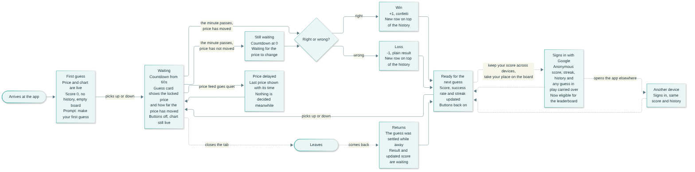
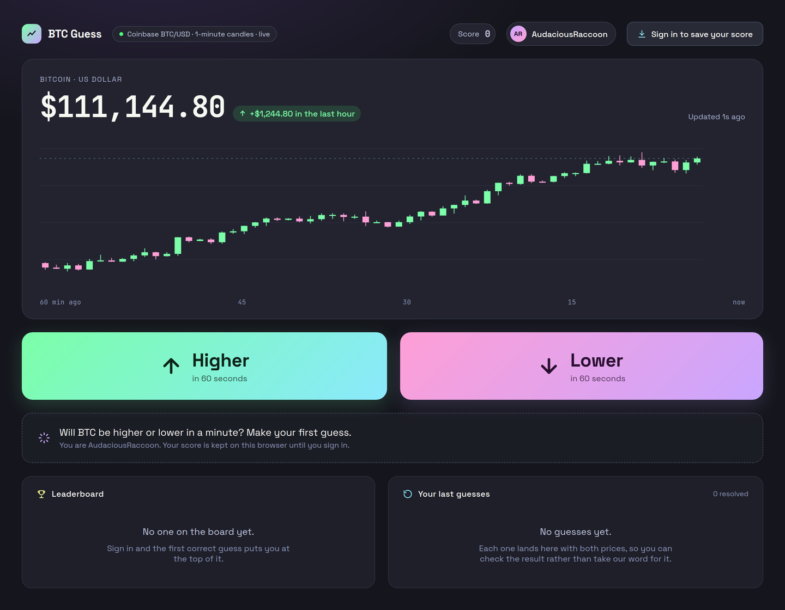
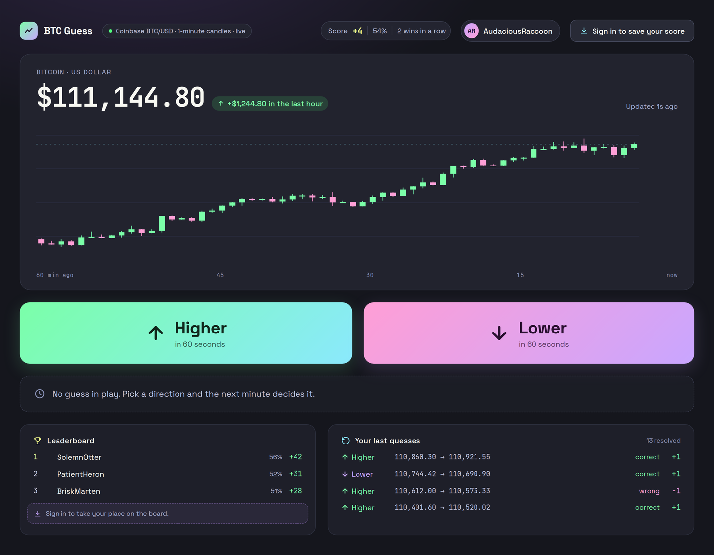
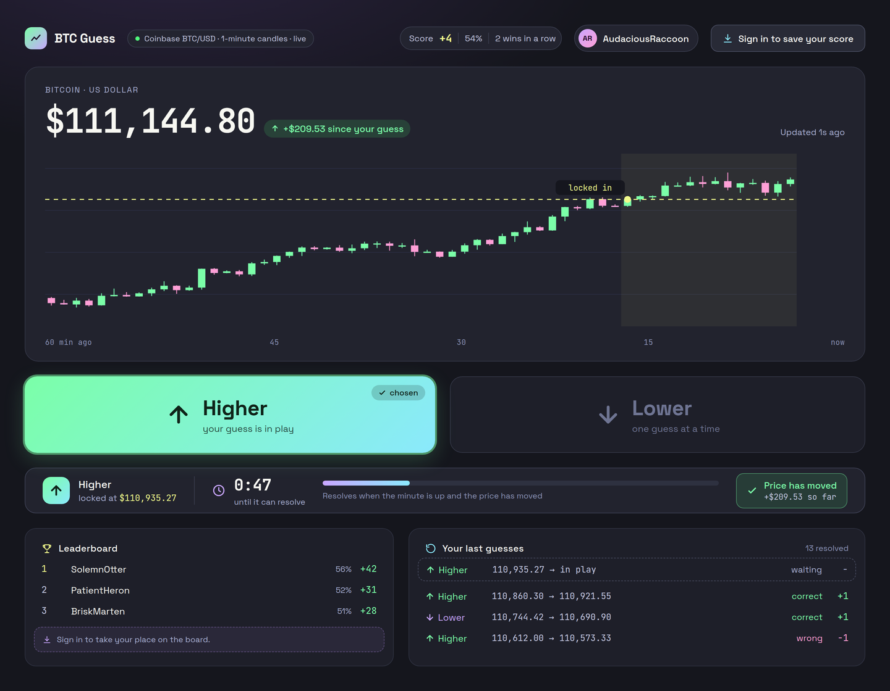
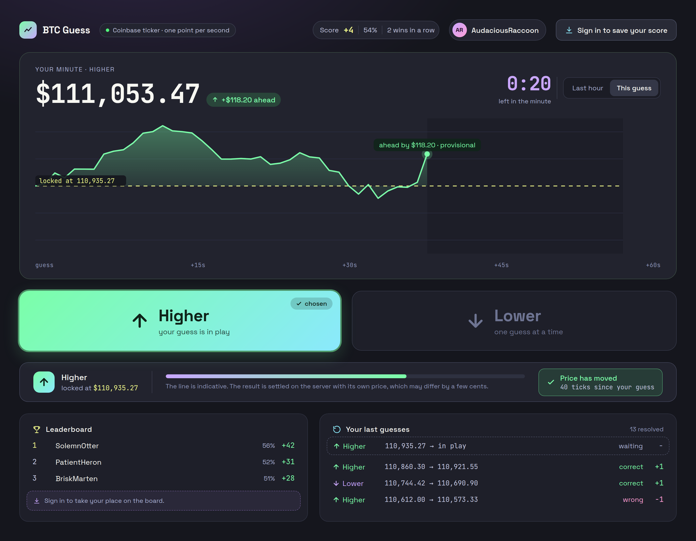
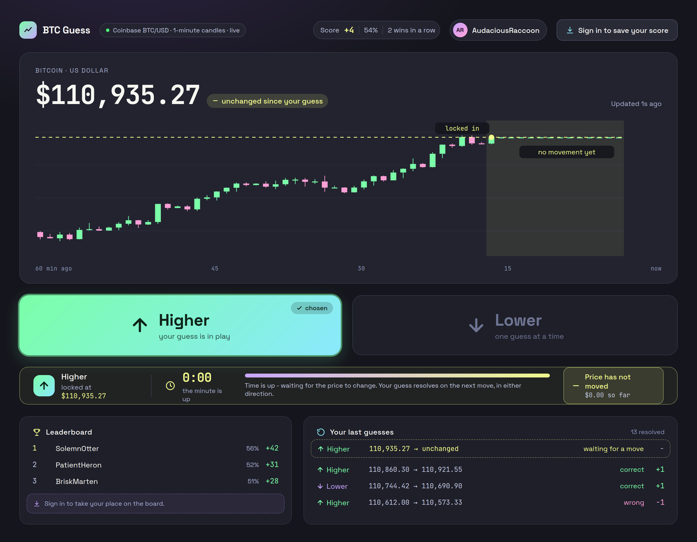
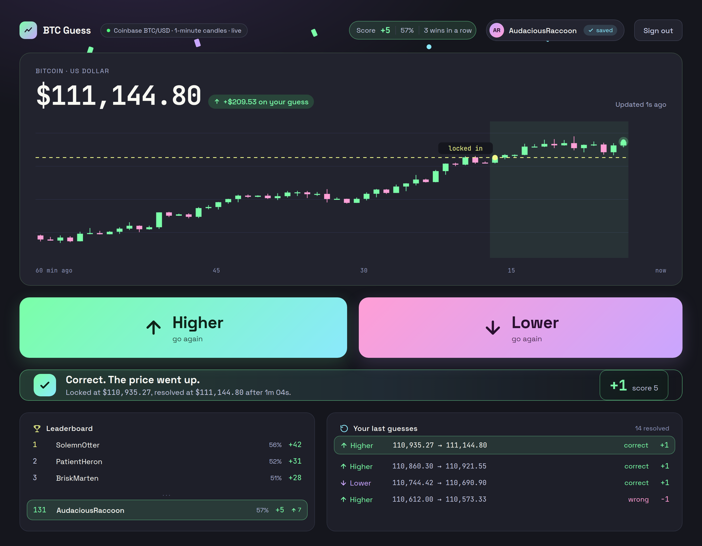
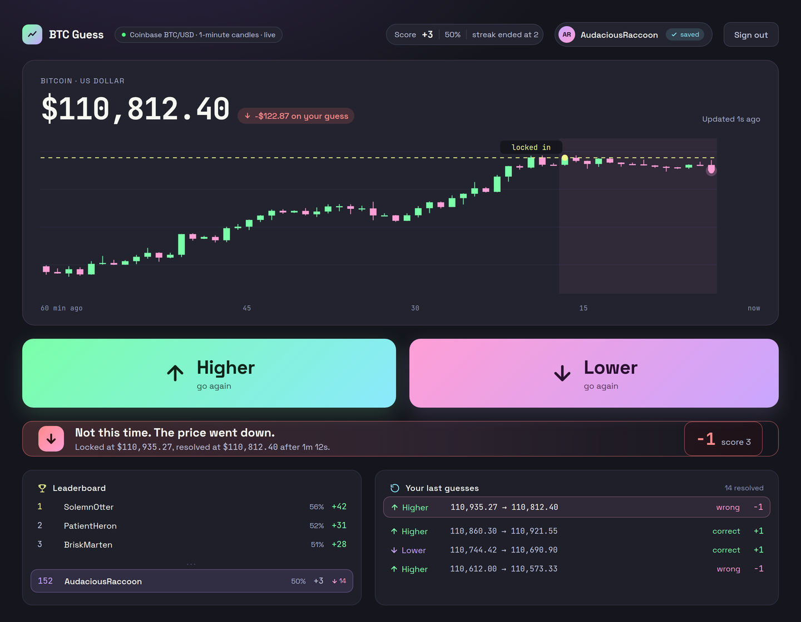

# Product spec - BTC up/down guessing game

**Author:** Inês Carvalho · **Date:** 27 Sep 2026

**Companion document:** `engineering-spec.md`, which covers how all of this is built.

---

## 1. What it is

A player guesses whether the BTC/USD price will be higher or lower one minute from now. Correct guess, +1 point; wrong guess, -1. One guess at a time, and the price comes from a real exchange, so every round is a real minute of a real market.

The product question underneath it: **can a player trust the result?** A guessing game where the outcome is decided somewhere invisible is not a game, it is a claim. So the design goal is that the player can watch the thing they bet on, see the price their guess was locked at, and check afterwards what happened. Fairness has to be visible, not promised.

---

## 2. Rules (from the brief)

| # | Rule |
|---|---|
| R1 | Score and latest price are visible at all times |
| R2 | A guess is either "up" or "down" |
| R3 | No new guess until the current one resolves |
| R4 | A guess resolves when the price changes **and** at least 60 seconds have passed |
| R5 | Correct adds 1 point, wrong subtracts 1 |
| R6 | One guess at a time per player |
| R7 | New players start at 0 |

**The score may go negative.** The brief sets no floor and this spec assumes there is none, which shapes how a loss is presented (see 6.4).

---

## 3. Scope

### In

- One screen: score, live price, last-hour chart, up/down buttons, history.
- A guess, a countdown, and a resolution the player can watch happen.
- A score that survives closing the browser.
- Optional Google sign-in, so score and history follow the player across devices.
- A scoreboard: success rate, streaks, and the last guesses with the prices behind them.
- A leaderboard for signed-in players, where everyone appears under a generated name.

### Out, and named as future work

- Sign-in providers beyond Google, and self-service account deletion.
- Live multiplayer, friend lists, leaderboards over time windows (this week, today), and a country view of the board.
- An opponent bot. (How it would work: a scheduled job playing a fixed strategy under a reserved player, with a leaderboard to compare against.)
- Trading pairs other than BTC/USD.
- Variable stakes or configurable guess windows.

---

## 4. User flow



One screen throughout; what changes is what it offers and what it says. Three things the diagram is meant to make obvious:

- **Waiting has three shapes**, and only one of them is the countdown.
- **Leaving is safe:** the guess settles anyway and the result is waiting on the way back.
- **Sign-in sits off to the side.** It is reachable from the game, never in front of it, and it carries the anonymous player's name and any guess in play, but the score starts again from zero (6.3).

The Mermaid source is in `flows/00-user-flow.mmd`.

---

## 5. The screens

Designed against the flow above. The visual language is the Dracula palette on a near-black ground, with pastel gradients reserved for the two hero actions, built on the Astryx component library.

**Day zero.** The first thing anyone sees: no guesses, no history, nobody on the board. The chart is the exception, and deliberately so - the market has an hour behind it whether or not anyone has played, so the one thing alive on an otherwise empty screen is the thing the game is about. Both empty cards say what will fill them rather than apologising for being empty, and the score shows a plain `0` with no success rate and no streak beside it (6.5).



**Ready to guess.** The same screen once there is a history behind it: chart and the two buttons are the hero, the guess area is an empty state, leaderboard and history sit quietly at the bottom.



**Guess in play.** The chosen button stays lit and marked, the other goes flat and disabled, and the strip under them carries the locked price, the countdown and whether the price has moved.



**The minute, live.** Optional, and the reason the waiting minute is worth watching: the chart switches from the hour to the minute itself, drawn live from the game price at one point per second, against the dashed line where the guess was locked.



**Time up, price unchanged.** The state everyone forgets. The countdown holds at zero, the last candles sit flat on the locked price, and the app says what it is waiting for.



**Correct.** Confetti, a mint banner, the score and streak updated, and a new row at the top of the history.



**Wrong.** The same banner shape in coral, so the two outcomes are clearly the same kind of event - but no confetti, and the streak reads as ended rather than zero.



---

## 6. The player experience

The reasoning behind the flow and the screens above.

### 6.1 The chart

Two views of the same market, switched by a control in the chart header - **Last hour** and **This guess**.

**The hour: sixty one-minute candles.**

- **Why candles and not a line:** each candle is one minute, which is the unit the game is played in. Open, close and the wicks show how much the price moved inside a minute, which is exactly what the player is betting on.
- **Why an hour:** over a minute BTC barely moves, and a number alone gives nothing to reason about. An hour of history makes a tiny move legible - climbing, sliding or flat.
- **The Y axis must not start at zero**, or the chart is a flat line. It fits the data range with a small margin.
- **During a guess the chart carries the guess:** a dashed line at the locked-in price, and the minute since the guess shaded.

**The minute: a live line, one point per second** (see the third screen above). Once a guess is in play the view can switch to the minute itself: the X axis restarts at the guess, the dashed line is the price locked in, and the area between it and the live line is the margin the player is winning or losing by. The countdown becomes the axis rather than a number off to the side.

- **Why a line here and candles there:** a whole minute is a single candle, so candles say nothing at this zoom. Different question, different chart.
- **One point per second** is enough. BTC ticks several times a second; drawing all of them costs work and reads as noise, while sixty points make a legible, slightly jagged line - which suits the moment.
- **It is indicative, and says so.** The label reads *"ahead by $118.20 · provisional"*, because the result is settled on the server with its own price and may differ by a few cents. Showing the drama must not promise the outcome.
- **The hour view stays one click away**, and the game returns to it after the result.

### 6.2 The waiting minute

After guessing, the buttons switch off and a countdown runs from 60 seconds. The guess card shows the price the guess was locked at and how far the price has moved since.

Waiting is not one state, and the player is never left guessing which one they are in:

| Situation | What the player sees |
|---|---|
| Under a minute | Countdown running |
| A minute passed, price has not moved | Countdown at 0, with *"Time is up - waiting for the price to change"* |
| Price feed is behind | *"Price feed delayed. Last updated 25s ago. Nothing is settled until it catches up."* |

The second is the brief's own rule made visible. The third is ours: a stale price never decides anything, which protects the player from a result that was not really earned.

### 6.3 Identity: anonymous first, sign-in as an upgrade

A first-time visitor guesses immediately. No account, no email, nothing asked. Their score lives with their browser.

Signing in with Google is offered as a benefit, never a gate: the button says what it does and what it is for, **"Sign in to save your score"**, and the reason is keeping that score across devices. Once signed in, score, streak and history follow them from laptop to phone and survive clearing the browser - counted from the moment they sign in.

- **Playing anonymously and then signing in keeps the name and any guess in play, but the score starts again from zero.** The board counts only what is earned while signed in: anonymous players are free to make in any number, so a score built before signing in proves nothing. The screen says so plainly rather than resetting it silently. Trying the game first costs those first points, and nothing else.
- **Signing in on a device that already has an account shows the saved score**, and says so plainly rather than silently replacing what was on screen.
- **Signing out** returns the player to anonymous play. Nothing is deleted.
- **We ask for the minimum:** no email, no contacts, no calendar. Just enough to know it is the same person.

What we do *not* do is identify players by IP address. It is shared (everyone on the same wi-fi would share a score), unstable (switching to mobile data loses it), and it is personal data with a retention and deletion story attached - a lot of downside for something that does not even work.

### 6.4 Winning and losing

- **Winning is loud:** +1, confetti, a mint banner, and the result spelled out - *"Correct. The price went up. Score 3."*
- **Losing is quiet, but not smaller:** -1 in the same banner, same shape, same weight, in coral instead of mint - *"Not this time. The price went down. Score 1."* No confetti, and the streak reads as *"streak ended at 2"* rather than a bare zero.

The two outcomes share a shape so they read as the same kind of event, and differ in colour and in what moves. The coral is a pastel red rather than Dracula's full `#FF5555`: on a dark ground the pure red vibrates and takes more attention than an outcome that happens half the time deserves.

The asymmetry is deliberate. With a score that can go negative and odds close to a coin flip, a loss has to read as a turn of the game rather than a punishment, or players stop after two.

Confetti is skipped for players whose system asks for reduced motion, and every outcome is announced to screen readers as a full sentence.

### 6.5 The scoreboard

The brief asks for a score. A bare integer says very little: -2 could be two unlucky guesses or forty near-even ones.

| Stat | Definition | Before the first result |
|---|---|---|
| Score | Sum of +1 and -1, may be negative | `0` |
| Resolved guesses | Guesses that reached an outcome | `0` |
| Success rate | Correct ÷ resolved, as a percent - 2 correct out of 10 is 20% | `-` |
| Current streak | Consecutive wins or losses | `-` |
| Best streak | Longest winning run | `-` |
| Recent guesses | Last 10, each with the time it was locked in, direction, both prices and the outcome | "No guesses yet" |

Why it earns its place:

- **It makes fairness checkable.** Each row shows the two prices the game used and the minute between them. The player can verify the result instead of trusting it.
- **It gives a negative score context.** "-2, 48% over 25 guesses" reads as a coin flip, which is what this is. "-2" alone reads as failure.
- **It is the foundation for what comes next.** A leaderboard or a bot opponent are both "compare these numbers between players".

Presentation: the score stays the primary number, with success rate and streak as secondary text. Success rate stays hidden until something has resolved, because "100%" after one guess is noise. Outcomes never rely on colour alone - an icon and a word carry the meaning too.

---

### 6.6 Public identity: a generated name

Every player gets a name the moment they arrive, in the shape of an adjective and an animal: **AudaciousRaccoon**, **PatientHeron**, **SolemnOtter**. It is generated by the server, shown next to their score, and it is how they appear to everyone else.

Three reasons this is the right default rather than a placeholder:

- **Nobody is asked to invent anything.** No username field, no "that name is taken", no dead end before the first guess.
- **It protects signed-in players.** Someone who signs in with Google has handed us a real name; showing it on a public leaderboard would be a surprise nobody agreed to. The generated name is the public identity for everyone, signed in or not, and the Google account stays private.
- **It is memorable enough to be fun.** Coming back and finding SolemnOtter on the board is a small, cheap pleasure, and it makes a leaderboard feel populated rather than anonymous.

Names come from curated word lists, so no combination lands somewhere unfortunate. Two players may share one; the game does not care, and it keeps generation instant. Regenerating a name is a future nicety, not a requirement.

A country flag beside each name was considered and dropped. It would have been decoration bought with either a privacy question or infrastructure the hosting choice does not allow (engineering spec, 6.3), and a country view of the board is future work rather than a gap.

### 6.7 Leaderboard

One board, global. Each row is rank, generated name, score, success rate and number of guesses - the same numbers as the player's own scoreboard, so the two agree.

**The board is four rows: the top three, and you.**

```
1.   SolemnOtter        42   56%   75 guesses
2.   AudaciousRaccoon   38   54%   70 guesses
3.   PatientHeron       31   52%   60 guesses
     ...
138. BriskMarten        -2   48%   25 guesses      ← you
```

If the player is already in the top three, their row is simply highlighted and there is no ellipsis - the board is three rows.

Why three and not twenty: three is the podium, which is the part anyone actually reads, and the only other row that matters to a player is their own. A long list pushes the game off the screen and asks people to scan for themselves; this shows the target and the distance to it in four lines.

Decisions worth stating:

- **The player's own row is always present and highlighted**, with their real position. A leaderboard you cannot find yourself on is a wall, not a game.
- **Players on the same score share a rank.** Two players on 38 are both second, and the next one down is fourth. That is what people expect from a scoreboard, and it avoids arbitrary tie-breaking.
- **Only signed-in players appear, and that is deliberate twice over.** It is a correctness argument first: anyone can mint fresh anonymous players in incognito windows, so a board open to them measures patience rather than guessing. It is also the product's one honest piece of conversion. Anonymous players see the full board with their place on it missing and a line explaining what puts them there - the value is visible before anything is asked, which is the opposite of a wall. Sign-in is still never a gate on playing.
- **The board counts only score earned while signed in.** Signing in starts the record at zero, so nothing played anonymously ever reaches the board. This is what the board proves: every point was settled by the server for an account that was signed in. It does not prove one person per account - many Google accounts can still be farmed against each other - and that is out of scope for this game.
- **Success rate sits beside score**, because a score of 40 built on 500 guesses and one built on 60 are different achievements, and the board should not hide which is which.

---

## 7. Copy

- First visit: *"Will BTC be higher or lower in a minute? Make your first guess."*
- First visit, under it: *"You are AudaciousRaccoon. Your score is kept on this browser until you sign in."*
- Between guesses, once there is a history: *"No guess in play. Pick a direction and the next minute decides it."*
- Waiting: *"Locked at $X. 47s to go."* with the live gap beside it, for example *"+$12 so far"*.
- Countdown at zero: *"Time is up - waiting for the price to change."*
- Stale feed: *"Price feed delayed. Last updated 25s ago. Nothing is settled until it catches up."*
- Stale feed, no guess in play: the buttons go quiet with *"waiting for the price"*, and the strip says *"Price feed delayed. Nothing can be locked in until it catches up."* - a guess is refused before it is tried, not after.
- The price comes back with no guess in play: *"The price is back. You can guess again."* - announced once, as the delay was.
- No price has ever reached the game: *"The price is unavailable right now. Nothing can be guessed until it returns."*
- Chart unavailable: *"The chart is unavailable right now. The price above is the game's own and is unaffected."* - or just the first sentence when there is no price above it.
- Win: *"Correct. The price went up. Score 3."*
- Loss: *"Not this time. The price went down. Score 1."*
- Returning to a settled guess: *"While you were away: your up guess was correct. +1."*, or *"While you were away: your down guess was wrong. -1."* - in the result banner, said once, and not again on the next visit.
- Sign-in prompt, the top bar's button: *"Sign in to save your score"*
- Signed in, an anonymous player promoted: *"Signed in. Your score starts again from 0, because the board counts only what you play while signed in, and it now follows you to any device."*
- Signed in, a fresh account: *"Signed in. Your score now follows you to any device."*
- Signed in to an account that already had a score: *"Signed in. This is the score saved to your account. The one played on this browser is kept apart, and comes back if you sign out."*
- First visit, signed in: *"You are AudaciousRaccoon. Your score is kept with your account."*
- Leaderboard, empty: *"No one on the board yet."* with *"Sign in and the first correct guess puts you at the top of it."*
- Leaderboard, not signed in: *"Sign in to take your place on the board."*
- Leaderboard, outside the podium: *"138th of 1,204."*
- Leaderboard, on the podium: *"Second place. Nice."*
- History, empty: *"No guesses yet."* with *"Each one lands here with both prices, so you can check the result rather than take our word for it."*

These are also what a screen reader announces, which is why they are written as sentences.

---

## 8. Acceptance criteria

- [ ] Score and price are visible at all times, with an indication of when the price was last updated.
- [ ] Guessing disables further guesses until the current one resolves, including in a second tab.
- [ ] A guess never resolves before 60 seconds, nor on an unchanged price.
- [ ] Correct adds 1, wrong subtracts 1, and the score may go negative.
- [ ] The three waiting situations are distinguishable on screen.
- [ ] Closing the browser and coming back preserves score, history and any pending guess, which settles while away.
- [ ] Playing anonymously and then signing in keeps the name and any guess in play and starts the score at zero, with a sentence saying so; signing in on a second device shows the same state.
- [ ] The scoreboard's success rate and streaks match the history, with an empty state before the first result.
- [ ] A first visit shows a full chart, both buttons active, a plain `0` score with no rate or streak beside it, and two empty cards that say what will fill them.
- [ ] Every player has a generated name from the first visit.
- [ ] The leaderboard shows the top three, and for a signed-in player their own ranked row, whose numbers match their scoreboard.
- [ ] A player inside the top three sees their row highlighted there, with no duplicate row below.
- [ ] An anonymous player sees the board and the line explaining what puts them on it, and is never blocked from playing.
- [ ] A signed-in player's Google name never appears publicly.
- [ ] The chart keeps updating while a guess is pending.
- [ ] Outcomes are announced to screen readers, and confetti is skipped under reduced-motion preferences.

---

## 9. Priorities if time runs short

Built in this order, and anything below the line can be dropped without reworking what is above it:

1. A fair, working guess-and-resolve loop with a persisted score.
2. The waiting states and the result moments.
3. The last-hour chart.
4. The scoreboard, and the generated name.
5. Google sign-in.
6. The leaderboard.
7. The live minute view.
8. Confetti.

Two notes on the order:

- **The chart ranks high because it carries the tension.** It is half the hero of the screen, and it is what makes the waiting minute something to watch rather than something to sit through - a price with an hour behind it gives the player something to read (6.1). A version of this game without the chart is a poorer product than one without a leaderboard.
- **The leaderboard depends on sign-in**, because eligibility is being signed in (6.7). They are one item in two parts, not two independent ones: dropping 5 empties 6.
